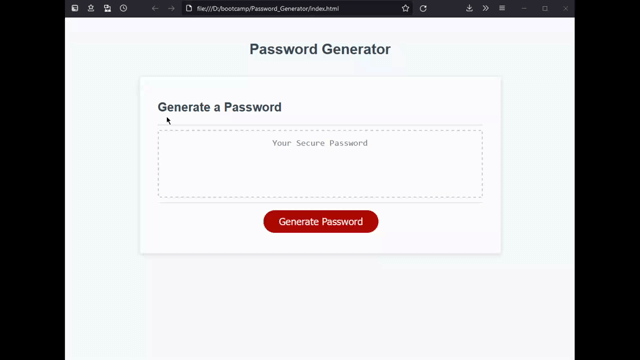
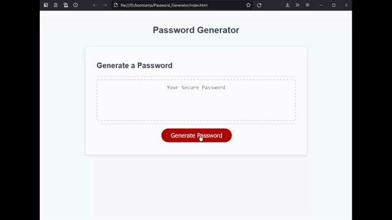

# Password Generator
A password generator which creates a secure password with character types chosen by the user. The user can choose the password length along with the option to use special characters, numbers, upper case, and lower case characters. The password is displayed on the webpage so the user can copy and paste.

## Project Description
This application is a password generator. When visiting the web page the user is greeted with an interface which includes a button to generate a password which will then appear on the page in the text box. When the user presses the generate password button, the browser prompts the user to enter the desired length of the password which must be between 8 and 128 characters. Once the user enters a valid length for the password, they must then confirm to use atleast 1 of four password criterias. These confirm boxes will ask if the user wants to include special characters, numeric characters, upper case characters, and lower case characters. If the user doesn't confirm to add any of the options, the webpage will alert the user that they need to confirm atleast 1 option from the 4 password criterias. Once the user has finished choosing which password criterias to use, the application will generate random characters from the chosen criterias and add them to a string which is then displayed on the webpage. 

 

 

## Deployment
This webpage is deployed through github pages:
https://dempleon.github.io/Password_Generator/

## Dev Notes
For this project I decided to create an object called passwordObj which contains object keys and values for the password length, password options, and the password generated. There are methods to set the passLength and password options. In the generatePass method, the setLength and setAttributes functions are called so the user can set the length and options, and then the generateChar function is called to generate a random character to concantenate to the passPhrase object key. The generatePass function then returns the password which is displayed in the webpage. The password generated will not include special characers: single quote, double qoute and backslash (escape sequence) to prevent bugs.
